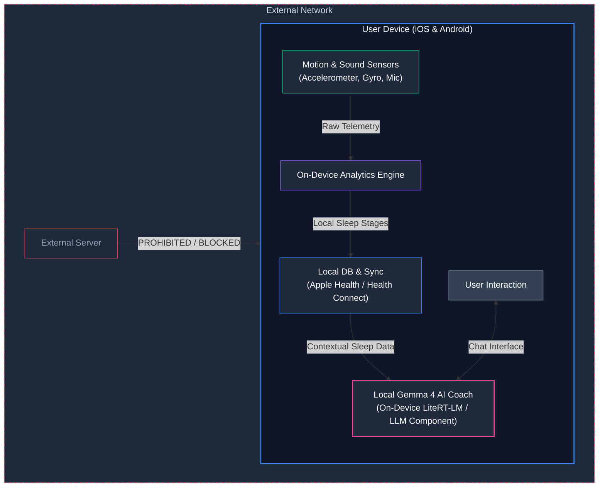

# 🌙 OpenSleep

  
  
  
  

---

### **OpenSleep** is a next-generation, premium sleep tracking application that redefines personal sleep science through a uncompromising **100% on-device, private-first architecture**. 

Unlike standard trackers that transmit your personal bio-data to remote servers, OpenSleep does all of its telemetry processing and advanced AI analysis directly on your smartphone. Featuring a fully integrated, localized **Gemma 4 AI Sleep Coach**, OpenSleep delivers personalized wellness guidance with complete cloud isolation.

---

## 🚀 Key Pillars

### 1. 🛡️ 100% On-Device & Zero-Server Privacy
* **Local Sensor Processing**: Raw accelerometer, gyroscope, and audio data from your device's sensors are analyzed completely locally.
* **No External Servers**: Zero analytics endpoints, zero tracking SDKs, and zero database synchronization in the cloud. Your data belongs to you alone.
* **Health Integration**: Syncs directly and securely with native system aggregates (**Apple Health** on iOS, **Google Health Connect** on Android) through highly secure local APIs.

### 2. 🧠 Local Gemma 4 AI Coach
* **Fully Offline Intelligence**: OpenSleep runs a highly optimized, localized **Gemma 4 LLM** directly on-device. No API requests, no cloud latency, and no chance of conversation leakage.
* **Smart Sleep Analytics**: The AI coach reads your sleep patterns locally to offer customized tips for improving sleep hygiene, tracking circadian rhythm, and managing daytime sleepiness.
* **Dynamic Chat Interface**: A gorgeous, reactive conversation dashboard supporting markdown rendering, tabular sleep summaries, and granular context window controls.

### 3. 📊 Interactive Analytics & Insights
* **Sleep Stage Breakdowns**: Premium multi-stage sleep graphs depicting Deep, Light, REM, and Awake durations.
* **Adaptive Calendars**: Toggle sleep history metrics seamlessly across daily, weekly, monthly, and yearly intervals.
* **Swipe-to-Manage Control**: Securely delete historical sleep sessions instantly with intuitive swipe-left triggers or bulk selection controls.

---

## 🏗️ Architecture & Data Flow

Below is the design of the on-device environment showing the isolation from external cloud services:

---

## 🛠️ Technology Stack

| Platform | Frontend | Local Storage | AI Engine |
| :--- | :--- | :--- | :--- |
| **iOS** | Swift & SwiftUI (Premium UI Design) | SwiftData & Apple HealthKit | LiteRT-LM (Swift Package) |
| **Android** | Kotlin & Jetpack Compose (Material 3) | Room & Google Health Connect | LiteRT-LM (Kotlin Library) |

---

> [!IMPORTANT]
> **OpenSleep does not connect to the internet.**
> It never collects, stores, or sells your personal information, sleep logs, audio metadata, or conversation histories. All AI calculations are run directly on the physical processor of your device.

---

## 📬 Support & Community

OpenSleep is an open-source project created and maintained for the benefit of developers and health enthusiasts alike. 

* **GitHub Repository**: [https://github.com/timmyy123/opensleep](https://github.com/timmyy123/opensleep)
* **Support Email**: If you have any inquiries, feedback, or need assistance, feel free to reach out directly to the creator at [timmy@opensleep.tech](mailto:timmy@opensleep.tech).

---
*OpenSleep — Your Sleep, Your Data, 100% On-Device.*
