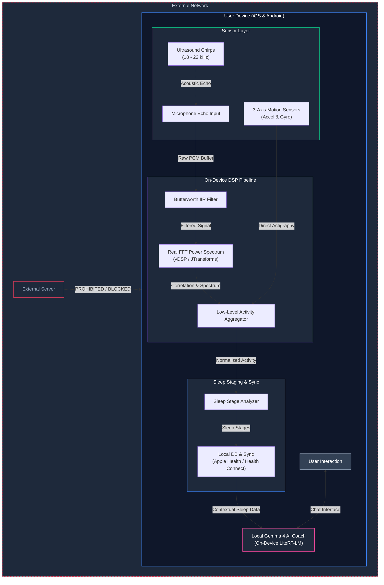

# 🌙 OpenSleep

  
  
  
  

  
  &nbsp;&nbsp;
  

---

### **OpenSleep** is a next-generation, premium sleep tracking application that redefines personal sleep science through a uncompromising **100% on-device, private-first architecture**. 

Unlike standard trackers that transmit your personal bio-data to remote servers, OpenSleep does all of its telemetry processing and advanced AI analysis directly on your smartphone. Featuring a fully integrated, localized **Gemma 4 AI Sleep Coach**, OpenSleep delivers personalized wellness guidance with complete cloud isolation.

---

## 🚀 Key Pillars

### 1. 🛡️ 100% On-Device & Zero-Server Privacy
* **Local Active Telemetry**: Ultrasonic sonar echo processing and motion actigraphy are analyzed completely on-device. Raw audio is processed in memory and never stored or transmitted.
* **No External Servers**: Zero analytics endpoints, zero tracking SDKs, and zero database synchronization in the cloud. Your data belongs to you alone.
* **Health Integration**: Syncs directly and securely with native system aggregates (**Apple Health** on iOS, **Google Health Connect** on Android) through highly secure local APIs.

### 2. 🧠 Local Gemma 4 AI Coach
* **Fully Offline Intelligence**: OpenSleep runs a highly optimized, localized **Gemma 4 LLM** directly on-device. No API requests, no cloud latency, and no chance of conversation leakage.
* **Smart Sleep Analytics**: The AI coach reads your sleep patterns locally to offer customized tips for improving sleep hygiene, tracking circadian rhythm, and managing daytime sleepiness.
* **Dynamic Chat Interface**: A gorgeous, reactive conversation dashboard supporting markdown rendering, tabular sleep summaries, and granular context window controls.

### 3. 📊 High-Precision Dual-Mode Sleep Tracking
* **Contactless Sonar (Active Ultrasonic)**: Uses the device speaker to emit inaudible high-frequency sound chirps (~18 kHz - 22 kHz) and records the reflected echo via the microphone. An on-device DSP pipeline (high-pass Butterworth filtering, FFT power spectrum analysis, and correlation mapping) detects respiration rates and body movement contactless from a nightstand.
* **Mattress Actigraphy (3-Axis Motion)**: Uses low-latency accelerometer and gyroscope updates to record physical body movement when the phone is placed flat on the mattress.
* **Scientific Sleep Staging**: Combines actigraphy and sonar activity to compute precise Deep, Light, REM, and Awake sleep stages through aligned heuristic models.

---

## 🏗️ Architecture & Data Flow

Below is the design of the on-device environment showing the active tracking loops and cloud isolation:

```mermaid
graph TD
    subgraph Device ["User Device (iOS & Android)"]
        subgraph Sensors ["Sensor Layer"]
            Speaker["Ultrasound Chirps<br>(18 - 22 kHz)"]
            Mic["Microphone Echo Input"]
            Motion["3-Axis Motion Sensors<br>(Accel & Gyro)"]
        end

        subgraph DSP ["On-Device DSP Pipeline"]
            IIR["Butterworth IIR Filter"]
            FFT["Real FFT Power Spectrum<br>(vDSP / JTransforms)"]
            Aggregator["Low-Level Activity Aggregator"]
        end

        subgraph Staging ["Sleep Staging & Sync"]
            Analyzer["Sleep Stage Analyzer"]
            Storage["Local DB & Sync<br>(Apple Health / Health Connect)"]
        end

        Speaker -.->|Acoustic Echo| Mic
        Mic -->|Raw PCM Buffer| IIR
        IIR -->|Filtered Signal| FFT
        FFT -->|Correlation & Spectrum| Aggregator
        Motion -->|Direct Actigraphy| Aggregator
        Aggregator -->|Normalized Activity| Analyzer
        Analyzer -->|Sleep Stages| Storage
        
        Storage -->|Contextual Sleep Data| AI["Local Gemma 4 AI Coach<br>(On-Device LiteRT-LM)"]
        User["User Interaction"] <-->|Chat Interface| AI
    end
    
    subgraph Cloud ["External Network"]
        direction LR
        Server["External Server"] -.->|PROHIBITED / BLOCKED| Device
    end
    
    style Device fill:#0f172a,stroke:#3b82f6,stroke-width:2px,color:#fff
    style Cloud fill:#1e293b,stroke:#f43f5e,stroke-width:1px,stroke-dasharray: 5 5,color:#cbd5e1
    style Sensors fill:#1e293b,stroke:#10b981,stroke-width:1px,color:#fff
    style DSP fill:#1e293b,stroke:#8b5cf6,stroke-width:1px,color:#fff
    style Staging fill:#1e293b,stroke:#3b82f6,stroke-width:1px,color:#fff
    style AI fill:#1e293b,stroke:#ec4899,stroke-width:2px,color:#fff
    style User fill:#334155,stroke:#94a3b8,stroke-width:1px,color:#fff
    style Server fill:#1e293b,stroke:#f43f5e,stroke-width:1px,color:#94a3b8
```

---

## 🛠️ Technology Stack

| Platform | Frontend | Local Storage | AI Engine |
| :--- | :--- | :--- | :--- |
| **iOS** | Swift & SwiftUI (Premium UI Design) | SwiftData & Apple HealthKit | LiteRT-LM (Swift Package) |
| **Android** | Kotlin & Jetpack Compose (Material 3) | Room & Google Health Connect | LiteRT-LM (Kotlin Library) |

> [!IMPORTANT]
> **OpenSleep does not connect to the internet.**
> It never collects, stores, or sells your personal information, sleep logs, audio metadata, or conversation histories. All AI calculations are run directly on the physical processor of your device.

---

## 📬 Support & Community

OpenSleep is an open-source project created and maintained for the benefit of developers and health enthusiasts alike. 

* **GitHub Repository**: [https://github.com/timmyy123/opensleep](https://github.com/timmyy123/opensleep)
* **Support Email**: If you have any inquiries, feedback, or need assistance, feel free to reach out directly to the creator at [timmy@opensleep.tech](mailto:timmy@opensleep.tech).

---
*OpenSleep — Your Sleep, Your Data, 100% On-Device.*
